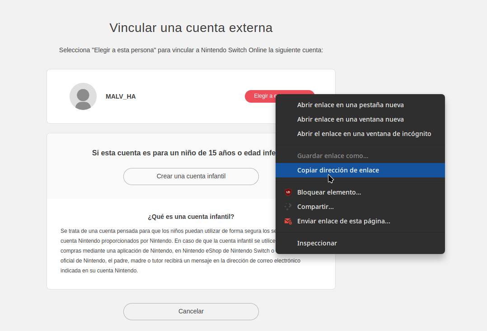

# Nintendo Switch Online Integration for Home Assistant

This component allows Home Assistant to get the status of different Nintendo Switch Online users, indicating if they are online and, if so, what game they are playing.

## Functionality

The component is based on the [nso-api](https://github.com/Jetsurf/nso-api) library which allows connecting to Nintendo's servers with an account and obtaining the status of that
account's friends.

Unfortunately, due to limitations of the Nintendo Switch API, it is not possible to obtain your own status, only that of your friends. Therefore, to use this component, you must \*
\*create a secondary account and add as friends the users whose status you want to obtain\*\*.

## Installation

To install this component, you can use HACS:

Or download it manually into the Home Assistant configuration folder.

## Configuration

Once installed, go to `Settings -> Devices & Services -> Add Integration` and search for "Nintendo Switch".

The wizard will ask for the login account link.

To get this link, go to the indicated URL and log in with your user account. Then, right-click on "Select this person" and copy the link of that button:

And paste that link in the requested field.

## Usage

Once the account is added, it will generate as many binary sensors as friends the account has, and if they are playing, it will have a "game" attribute which indicates the name of
the game they are playing.

The data updates every 30 seconds.

## New Friends

If you add new friends, you will need to reload the integration. This can be done directly from the integration screen or simply by restarting Home Assistant.
